## Advanced Lane Finding Project

The goals / steps of this project are the following:

* [Compute the camera calibration matrix and distortion coefficients given a set of chessboard images.](#jump1)
* [Apply a distortion correction to raw images.](#jump2)
* [Use color transforms, gradients, etc., to create a thresholded binary image.](#jump3)
* [Apply a perspective transform to rectify binary image ("birds-eye view").](#jump4)
* [Detect lane pixels and fit to find the lane boundary.](#jump5)
* [Determine the curvature of the lane and vehicle position with respect to center.](#jump6)
* [Warp the detected lane boundaries back onto the original image.](#jump7)
* [Output visual display of the lane boundaries and numerical estimation of lane curvature and vehicle position.](#jump8)
* [Discussion.](#jump9)

## Step 0 : import packages


```python
# -*- coding=UTF-8 -*-
import numpy as np
import os
import cv2
import glob
import pickle 
import matplotlib.pyplot as plt
import matplotlib.image as mping

%matplotlib inline
```

## <span id="jump1">Step 1: Compute the camera calibration matrix and distortion coefficients .</span>    
The camera calibration matrix was got in the [**Get-CameraMatrix-UndistortMatrix.ipynb**](./Get-CameraMatrix-UndistortMatrix.ipynb) file. Please run it at first to get camera matrix. Now just to load it.


```python
npzfile = np.load("camera_matrix.npz")
mtx = npzfile['mtx']
dist = npzfile['dist']
```

### Examples of undistorted image


```python
def imgUndistort(img, mtx=mtx, dist=dist):
    """
    Undistort image
    
    Arguments:
        img: source image
        mtx: camera internal matrix
        dist: distortion coefficients
    """
    return cv2.undistort(img, mtx, dist, None, mtx)


def show_undistort_image(img, mtx, dist, bBGR=False):
    """
    Comparely show origin image and undistort image
    
    Arguments:
        img: source image
        mtx: camera internal matrix
        dist: distortion coefficients
        bBGR: bool value, if BGR channel order
    """
    imgRGB = img
    if bBGR:
        imgRGB = cv2.cvtColor(img, cv2.COLOR_BGR2RGB)
        
    img_undistort =  imgUndistort(imgRGB, mtx, dist)
    plt.figure(figsize=(16,8))
    plt.subplot(1,2,1)
    plt.title("original Image", fontsize=16)
    plt.imshow(imgRGB)
    
    plt.subplot(1,2,2)
    plt.title("Undistorted Image", fontsize=16)
    plt.imshow(img_undistort)

    
def showImages(images, label=None, cols=3, figsize=(14,14), ticksshow=True):
    """
    Show cols images per colum
    
    Arguments:
        images: image list or array-like
        label: image label, list
        cols: the number of images per colums
        ticksshow: whether show ticks, bool value
    """
    rows = (len(images) + cols - 1)//cols 
    plt.figure(figsize=figsize)
    for i, image in enumerate(images):
        plt.subplot(rows, cols, i+1)
        
        # use gray scale color map if there is only one channel   
        imgShape = image.shape
        
        cmap = None       
        if len(imgShape) == 2: 
            cmap = "gray"
        elif  imgShape[2] == 1:
            image = image[:,:,0]
            cmap = "gray"
        
        plt.imshow(image, cmap=cmap)
        if label != None and label[i] != None:
            plt.title(label[i], fontsize=12)
            
        if not ticksshow:
            plt.xticks([])
            plt.yticks([])
            
    plt.tight_layout(pad=0, h_pad=0, w_pad=0)
    plt.show()
```


```python
show_undistort_image(cv2.imread("camera_cal/calibration2.jpg"),mtx,dist)
```


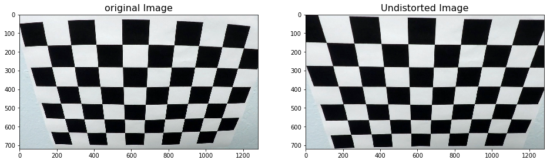


## <span id="jump2">Step 2: Apply a distortion correction to raw images.</span>    


```python
testImageList = glob.glob('test_images/*.jpg')
testImages = [cv2.cvtColor(cv2.imread(img), cv2.COLOR_BGR2RGB) for img in testImageList]
images_undistort = list(map(imgUndistort, testImages))
```


```python
# for filename in testImageList:
#     img = cv2.imread(filename)
#     imgRGB = cv2.cvtColor(img, cv2.COLOR_BGR2RGB)
#     show_undistort_image(imgRGB, mtx, dist)

showImages(images_undistort, testImageList, cols=3, figsize=(14,14), ticksshow=False)
```


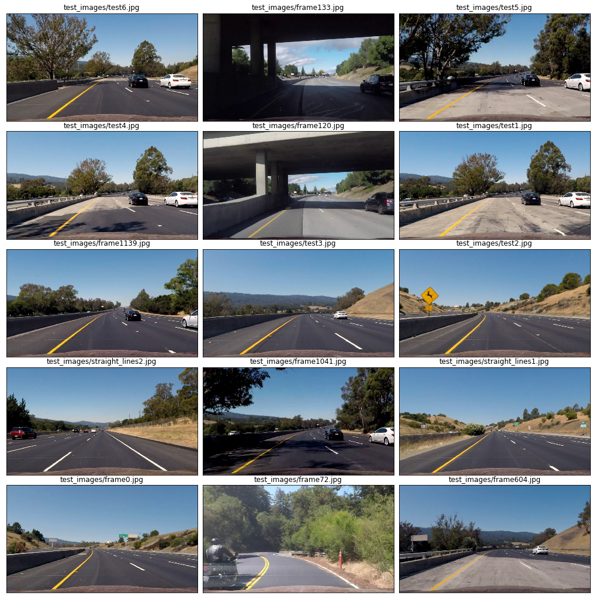


## <span id="jump3">Step 3: Use color transforms, gradients, etc., to create a thresholded binary image.</span>   

---
### Color transforms: HSL, HSV and Lab color space in split channels


```python
def splitChannels(img):
    """
    Split image into three channels in HSV, HLS and Lab separately
    
    Arguments:
        img: source image
    """
    channel_images=[]
    channel_images_label=[]
    
    #origin RGB image
    channel_images.append(img)
    channel_images_label.append('Original Image')
    
    gray = cv2.cvtColor(img, cv2.COLOR_RGB2GRAY)
    channel_images.append(gray)
    channel_images_label.append('Gray Image')  
    
    grayequalizeHist = cv2.equalizeHist(gray) 
    channel_images.append(grayequalizeHist)
    channel_images_label.append('EqualizeHist Gray Image') 
    
    #HLS image
    hls = cv2.cvtColor(img, cv2.COLOR_RGB2HLS)
    h = hls[:,:,0]
    l = hls[:,:,1]
    s = hls[:,:,2]
    channel_images.append(h)
    channel_images_label.append('HLS: H Channel Image') 
    channel_images.append(l)
    channel_images_label.append('HLS: L Channel Image') 
    channel_images.append(s)
    channel_images_label.append('HLS: S Channel Image') 
    
    #HSV image
    hsv = cv2.cvtColor(img, cv2.COLOR_RGB2HSV)
    h = hsv[:,:,0]
    s = hsv[:,:,1]
    v = hsv[:,:,2]
    channel_images.append(h)
    channel_images_label.append('HSV: H Channel Image') 
    channel_images.append(s)
    channel_images_label.append('HSV: S Channel Image') 
    channel_images.append(v)
    channel_images_label.append('HSV: V Channel Image') 
    
    #Lab image
    lab = cv2.cvtColor(img, cv2.COLOR_RGB2Lab)
    l = lab[:,:,0]
    a = lab[:,:,1]
    b = lab[:,:,2]
    channel_images.append(l)
    channel_images_label.append('Lab: L Channel Image') 
    channel_images.append(a)
    channel_images_label.append('Lab: a Channel Image') 
    channel_images.append(b)
    channel_images_label.append('Lab: b Channel Image') 
    
    return channel_images,channel_images_label
```


```python
testImgRGB = cv2.cvtColor(cv2.imread(testImageList[0]), cv2.COLOR_BGR2RGB)
testImg_undistort =  cv2.undistort(testImgRGB, mtx, dist, None, mtx)
images, label = splitChannels(testImg_undistort)

showImages(images, label, figsize=(14,14), ticksshow=False)
```


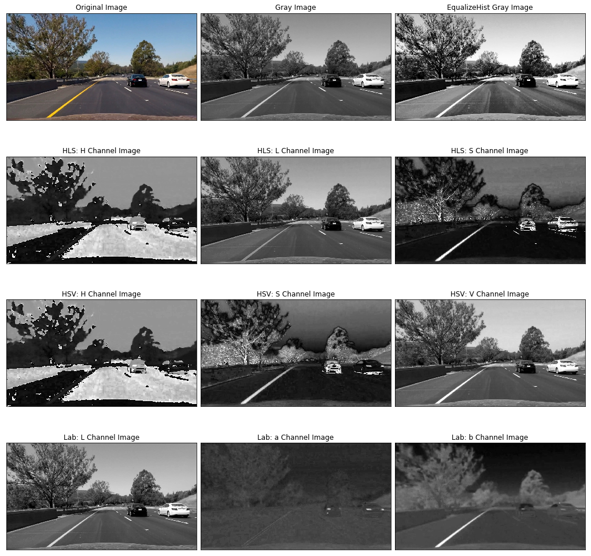


### Define color thresh functions


```python
def color_thresh(img, threshLow, threshHigh, colorSpace="HSV", oneChannel=None):
    """Convert color space to another, return binary image
    
    Arguments:
        img: RGB channel order
        colorSpace: "RGB", "HSV", "HSL"
        threshLow: if oneChannel=None (channel1, channel2, channel3) tuple, else single value
        threshHigh: if oneChannel=None (channel1, channel2, channel3) tuple, else single value
        oneChannel: appoint one channel
    """
    dstImg = np.zeros_like(img)
    
    if colorSpace == "HSV":
        dstImg = cv2.cvtColor(img, cv2.COLOR_RGB2HSV)
        
    if colorSpace == "HSL":
        dstImg = cv2.cvtColor(img, cv2.COLOR_RGB2HLS)
    
    if colorSpace == "Lab":
        dstImg = cv2.cvtColor(img, cv2.COLOR_RGB2Lab)
        
    if colorSpace == "RGB":
        dstImg = img
   
    # Return color select mask
    binary_output = np.zeros((img.shape[0], img.shape[1]))
    
    if oneChannel:
        oneChannelImage = dstImg[:,:,oneChannel]
        if colorSpace == "HSV":
            oneChannelImage = cv2.equalizeHist(oneChannelImage)
        binary_output[(oneChannelImage >= threshLow) & (oneChannelImage <= threshHigh)] = 1
    else:
        binary_output[(dstImg[:,:,0] >= threshLow[0]) & (dstImg[:,:,0] <= threshHigh[0]) & (dstImg[:,:,1] >= threshLow[1])  & (dstImg[:,:,1] <= threshHigh[1])  & (dstImg[:,:,2] >= threshLow[2]) & (dstImg[:,:,2] <= threshHigh[2])] = 1
                 
    return binary_output
```

### Yellow Lane filtered by Lab color space in b Channel


```python
color_binary = list(map(lambda img: color_thresh(img, 150, 255, colorSpace="Lab", oneChannel=2), images_undistort))

showImages(color_binary, testImageList, ticksshow=False)
```


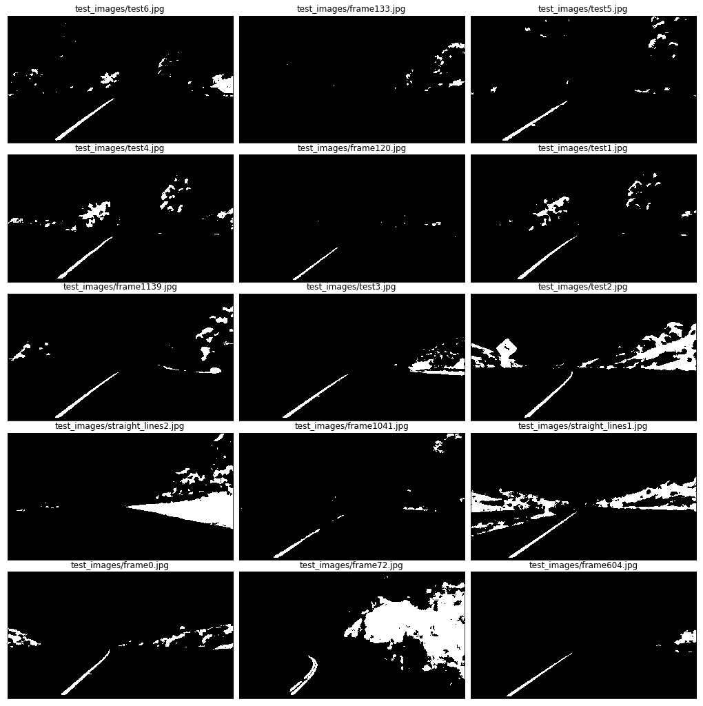


### White Lane filtered by HSL color space in Lightness Channel


```python
color_binary = list(map(lambda img: color_thresh(img, 210, 255, colorSpace="HSL", oneChannel=1), images_undistort))

showImages(color_binary, testImageList, ticksshow=False)
```


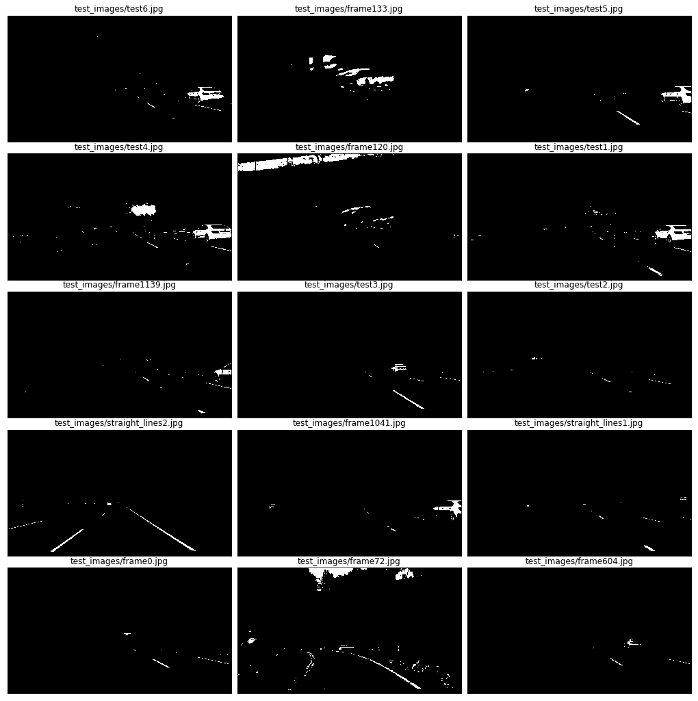


### Road Area Selected by HSV color space in Value Channel


```python
color_binary = list(map(lambda img: color_thresh(img, 145, 255, colorSpace="HSV", oneChannel=2), images_undistort))

showImages(color_binary, testImageList, ticksshow=False)
```


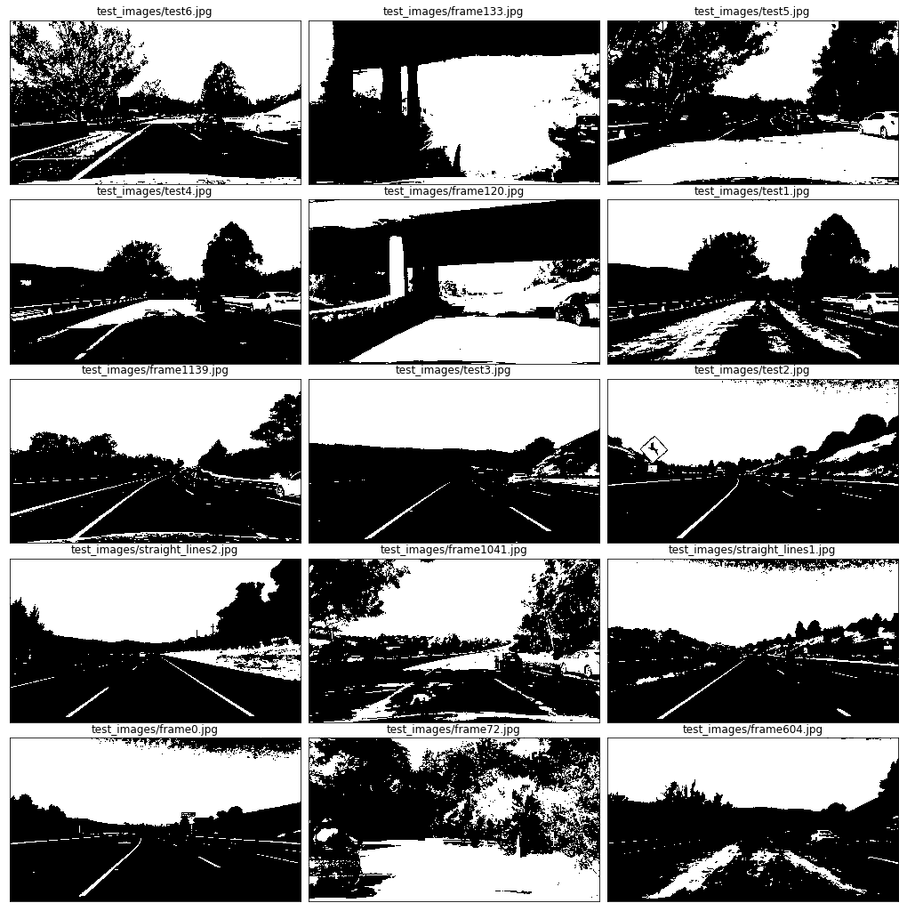


### Define Gradient and sobel functions


```python
def sobel_x(img, sobel_kernel=3, min_thresh = 20, max_thresh =100, colorSpace="HSL"):
    """
    Filter out horizontal noise, return binary image
    
    Arguments:
        img: source image
        colorSpace: "RGB", "HSL", "HSV"
        sobel_kernel: kernel size
        min_thes: min thresh
        max_thes: max thresh
    """
    dstImg = np.zeros_like(img)
    
    if colorSpace == "HSV":
        dstImg = cv2.cvtColor(img, cv2.COLOR_RGB2HSV)
        
    if colorSpace == "HSL":
        dstImg = cv2.cvtColor(img, cv2.COLOR_RGB2HLS)
        
    if colorSpace == "RGB":
        dstImg = img
    
    #Channels L and S from HLS
    sobelx1 = cv2.Sobel(dstImg[:,:,1], cv2.CV_64F, 1, 0, ksize=sobel_kernel)
    sobelx2 = cv2.Sobel(dstImg[:,:,2], cv2.CV_64F, 1, 0, ksize=sobel_kernel)
        
    # Scale to 8-bit (0 - 255) and convert to type = np.uint8
    scaled_sobelx1 = np.uint8(255*sobelx1/ np.max(sobelx1))
    scaled_sobelx2 = np.uint8(255*sobelx2/ np.max(sobelx2))

    # Create a binary mask where thresholds are met
    binary_outputx1 = np.zeros_like(scaled_sobelx1)
    binary_outputx1[(scaled_sobelx1 >= min_thresh) & (scaled_sobelx1 <= max_thresh)] = 1

    binary_outputx2 = np.zeros_like(scaled_sobelx2)
    binary_outputx2[(scaled_sobelx2 >= min_thresh) & (scaled_sobelx2 <= max_thresh)] = 1

    binary_output = np.zeros_like(scaled_sobelx1)
    binary_output[(binary_outputx1 ==1) | (binary_outputx2 ==1)]=1
    
    return binary_output

def sobel_thresh(img, orientation='x', sobel_kernel=5, min_thresh=20, max_thresh=255):
    gray = cv2.cvtColor(img, cv2.COLOR_RGB2GRAY)
    gray = cv2.equalizeHist(gray)
    
    if orientation == 'x':
        abs_sobel = np.absolute(cv2.Sobel(gray, cv2.CV_64F, 1, 0, ksize=sobel_kernel))
    
    if orientation == 'y':
        abs_sobel = np.absolute(cv2.Sobel(gray, cv2.CV_64F, 0, 1, ksize=sobel_kernel))
        
    scaled_sobel = np.uint8(255*abs_sobel/ np.max(abs_sobel))
    
    binary_output = np.zeros_like(scaled_sobel)
    binary_output[(scaled_sobel >= min_thresh) & (scaled_sobel <= max_thresh)] = 1
    
    return binary_output


def gradMag_thresh(img, sobel_kernel=3, gradmag_thresh=(50, 255)): 
    """
    Calulate magnitude of gradient, return binary image
    
    Arguments:
        img: source image
        sobel_kernel: kernel size
        gradmag_thresh: magnitude of gradient threshold
    """
    # Convert to grayscale
    gray = cv2.cvtColor(img, cv2.COLOR_RGB2GRAY)
    
    # Take the gradient in x and y separately
    sobelx = cv2.Sobel(gray, cv2.CV_64F, 1, 0, ksize=sobel_kernel)
    sobely = cv2.Sobel(gray, cv2.CV_64F, 0, 1, ksize=sobel_kernel)
    
    # Calculate the magnitude of gradient
    gradmag = np.sqrt(sobelx**2 + sobely**2)
    
    # Scale to 8-bit (0 - 255) and convert to type = np.uint8
    scaled_sobel = np.uint8(255*gradmag / np.max(gradmag))
       
    # Create a binary mask where mag thresholds are met
    binary_output = np.zeros_like(scaled_sobel)
    binary_output[(scaled_sobel >= gradmag_thresh[0]) & (scaled_sobel <= gradmag_thresh[1])] = 1

    return binary_output


#Direction threshold
def direction_thresh(img, sobel_kernel=3, thresh=(0.7, np.pi/2)):
    """
    Using angle thesh
    
    Arguments:
        img: source image
        sobel_kernel: kernel size
        thresh: angle rangement
    """
    # Convert to grayscale
    gray = cv2.cvtColor(img, cv2.COLOR_RGB2GRAY)

    # Take the gradient in x and y separately
    sobelx = cv2.Sobel(gray, cv2.CV_64F, 1, 0, ksize=sobel_kernel)
    sobely = cv2.Sobel(gray, cv2.CV_64F, 0, 1, ksize=sobel_kernel)

    # Take the absolute value of the x and y gradients
    abs_sobelx = np.absolute(sobelx)
    abs_sobely = np.absolute(sobely)

    # Use np.arctan2(abs_sobely, abs_sobelx) to calculate the direction of the gradient 
    absgraddirection = np.arctan2(abs_sobely, abs_sobelx) 

    # Create a binary mask where direction thresholds are met
    binary_output = np.zeros_like(absgraddirection)
    binary_output[(absgraddirection >= thresh[0]) & (absgraddirection <= thresh[1])] = 1

    return binary_output

#Both Magnitude and direction threshold
def gradMag_direction_thresh(img, sobel_kernel=3, mag_thresh=(50, 255), dir_thresh=(0.7, np.pi/2)):
    """
    Both using Magnitude of gradient and angle direction thresh, return binary image
    
    Arguments:
        img: source image
        sobel_kernel: kernel size
        mag_thresh: magnitude of gradient thresh
        dir_thresh: direction thresh
    """
    # Convert to grayscale
    gray = cv2.cvtColor(img, cv2.COLOR_RGB2GRAY)
    
    # Take the gradient in x and y separately
    sobelx = cv2.Sobel(img, cv2.CV_64F, 1, 0, ksize=sobel_kernel) 
    sobely = cv2.Sobel(img, cv2.CV_64F, 0, 1, ksize=sobel_kernel)
    
    # Calculate the magnitude of gradient
    gradmag = np.sqrt(sobelx**2 + sobely**2)
    
    #Calculate angle
    abs_sobelx = np.absolute(sobelx)
    abs_sobely = np.absolute(sobely)
    absgraddir = np.arctan2(abs_sobely, abs_sobelx) 

    # Scale to 8-bit (0 - 255) and convert to type = np.uint8
    scaled_sobel = np.uint8(255*gradmag / np.max(gradmag))
       
    # Create a binary mask where mag thresholds are met
    binary_output = np.zeros_like(scaled_sobel)
    binary_output[(scaled_sobel >= mag_thresh[0]) & (scaled_sobel <= mag_thresh[1]) & (absgraddir >= dir_thresh[0]) & (absgraddir <= dir_thresh[1]) ] = 1

    return binary_output
```

## Examples of gradient  thresholds


```python
gradient_binary = list(map(sobel_x, images_undistort))

showImages(gradient_binary, testImageList, ticksshow=False)
```


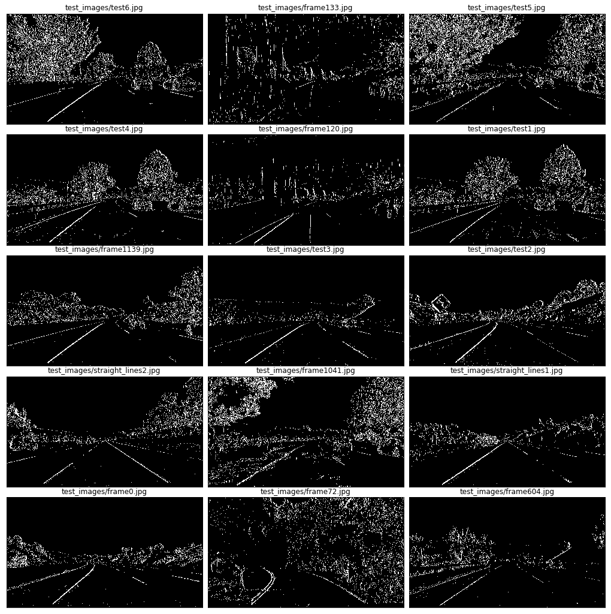


```python
gradient_binary = list(map(sobel_thresh, images_undistort))

showImages(gradient_binary, testImageList, ticksshow=False)
```


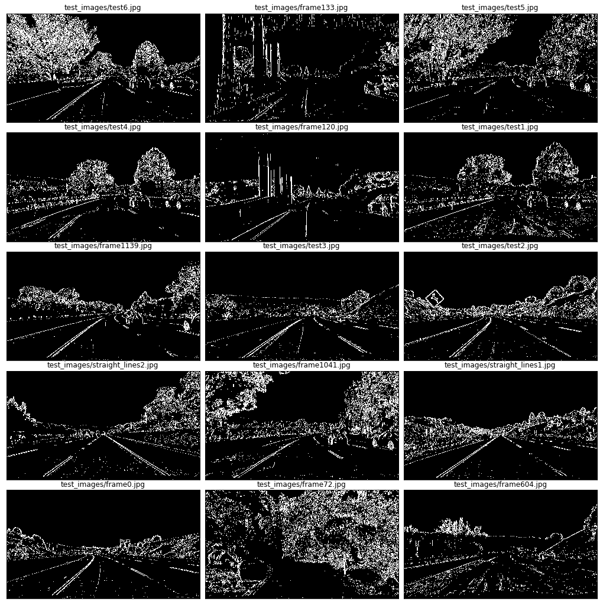


```python
gradient_binary = list(map(gradMag_thresh, images_undistort))

showImages(gradient_binary, testImageList, ticksshow=False)
```


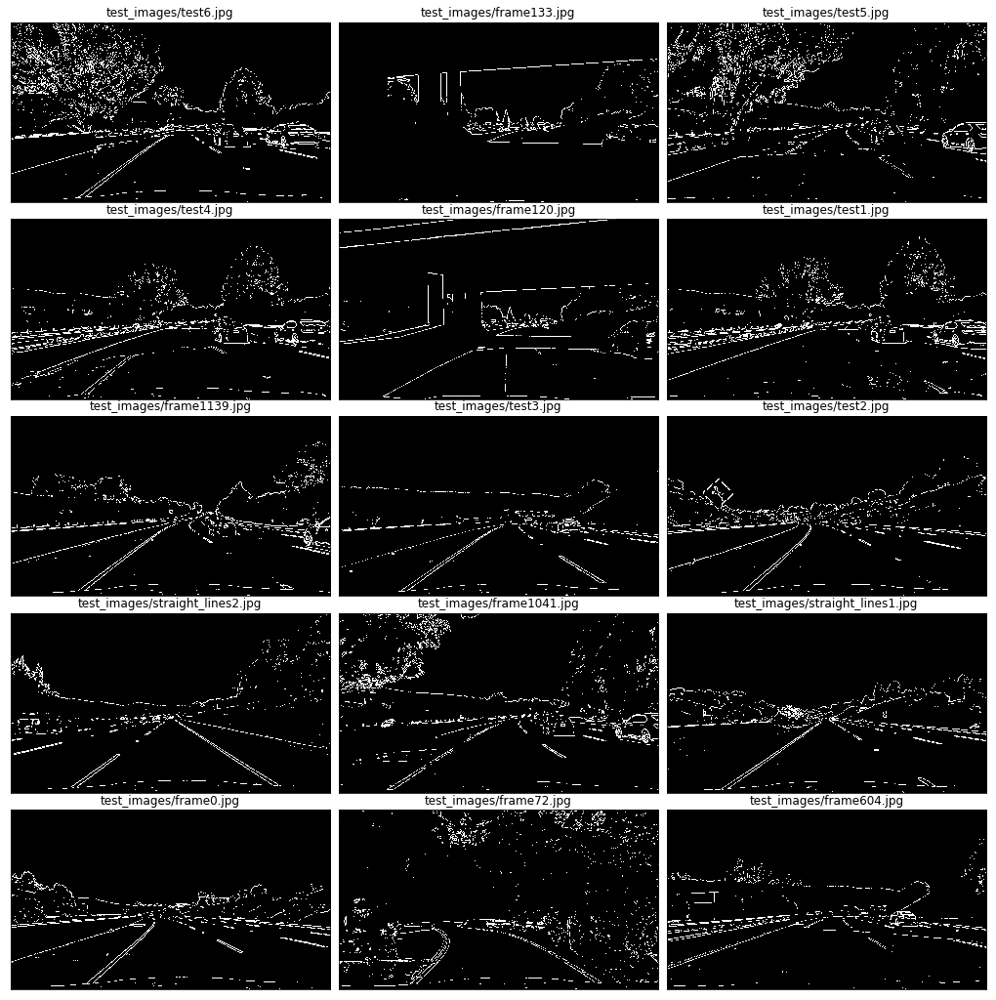


```python
def pipeline(img):
    sobel_thresh_binary = sobel_thresh(img)
    hsv_thresh_binary = color_thresh(img, 145, 255, colorSpace="HSV", oneChannel=2)
    hsl_thresh_binary = color_thresh(img, 210, 255, colorSpace="HSL", oneChannel=1)
    lab_thresh_binary = color_thresh(img, 150, 255, colorSpace="Lab", oneChannel=2)

    combined_binary = np.zeros_like(sobel_thresh_binary)   
    combined_binary[ ((sobel_thresh_binary == 1) & (hsv_thresh_binary == 1)) |(hsl_thresh_binary == 1)| (lab_thresh_binary == 1)] = 1
    
    return combined_binary
```


```python
filted_binary = list(map(pipeline, images_undistort))
showImages(filted_binary, testImageList, ticksshow=False)
```


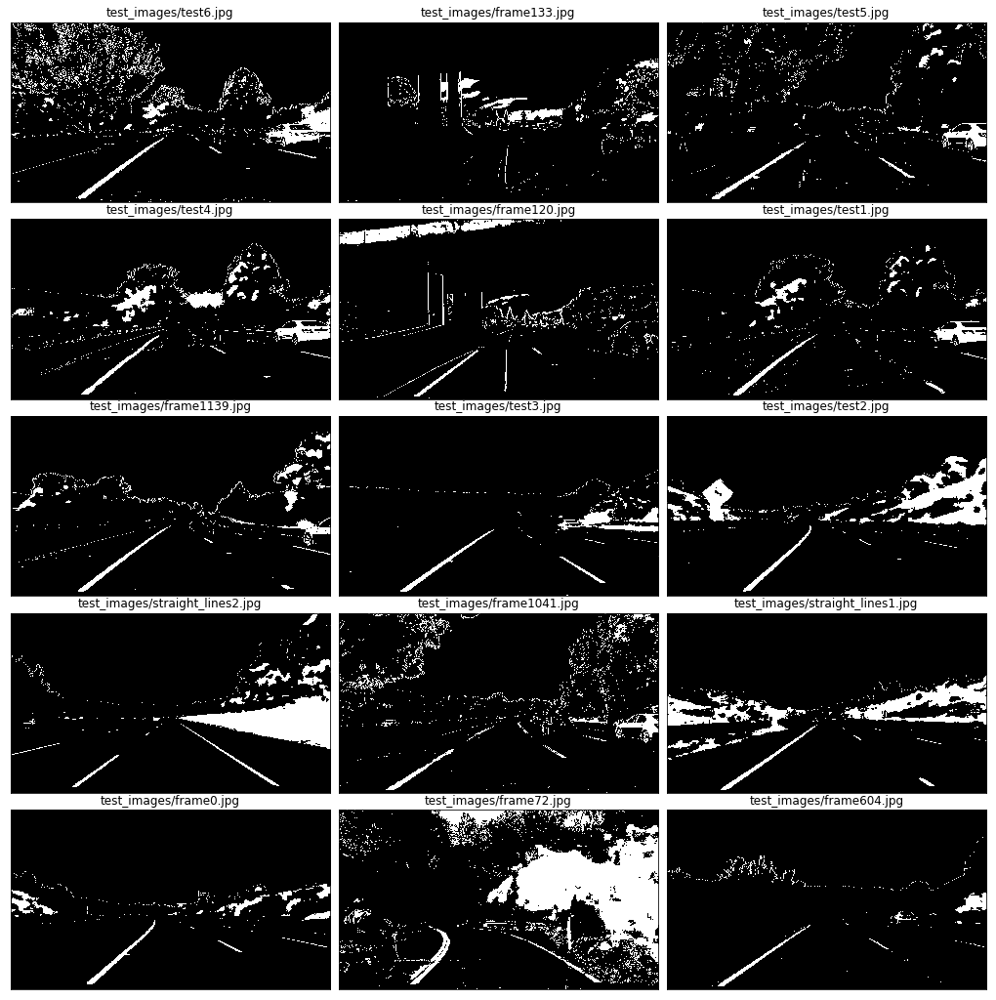


## <span id="jump4">Step 4: Apply a perspective transform to rectify binary image ("birds-eye view").</span>
---
### Perspective Transformed View Point


```python
def perspective_transform_matrix(img, show_debug=False):
    img_size = img.shape[:2][::-1]
    src = np.float32(\
    [[(img_size[0] / 2) - 75, img_size[1] / 2 + 110],\
     [((img_size[0] / 6) - 10), img_size[1]],\
     [(img_size[0] * 5 / 6) + 60, img_size[1]],\
     [(img_size[0] / 2 + 75), img_size[1] / 2 + 110]]) 

    dst = np.float32(\
    [[(img_size[0] / 4), 0],\
     [(img_size[0] / 4), img_size[1]],\
     [(img_size[0] * 3 / 4), img_size[1]],\
     [(img_size[0] * 3 / 4), 0]])
    
    M = cv2.getPerspectiveTransform(src, dst)
    Minv = cv2.getPerspectiveTransform(dst, src)
    
    if show_debug == True:
        print("source view point")
        print(src)
        print("Transformed view point")
        print(dst)

        plt.figure(figsize=(16, 16))
        plt.subplot(1, 2, 1)
        plt.imshow(img) 
        plt.plot(src[:,0], src[:,1], 'rx')
        plt.title('Original Image')

        plt.subplot(1, 2, 2)
        warped = cv2.warpPerspective(img, M, img_size, flags=cv2.INTER_LINEAR)
        plt.imshow(warped) 
        plt.plot(dst[:,0], dst[:,1], 'rx')
        plt.title('Perspective Transformed Image')
    
    return M, Minv
```


```python
straightimage = mping.imread('test_images/straight_lines1.jpg')

M,Minv = perspective_transform_matrix(straightimage,show_debug=True)
```

    source view point
    [[  565.           470.        ]
     [  203.33332825   720.        ]
     [ 1126.66662598   720.        ]
     [  715.           470.        ]]
    Transformed view point
    [[ 320.    0.]
     [ 320.  720.]
     [ 960.  720.]
     [ 960.    0.]]


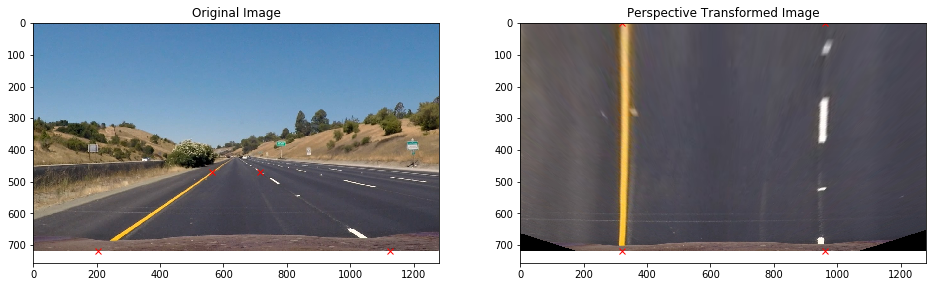


```python
def warpImage(img):
    img_size = img.shape[:2][::-1]
    
    M, Minv = perspective_transform_matrix(img)
    return cv2.warpPerspective(img, M, img_size, flags=cv2.INTER_LINEAR)
```

### Lane marked Perspective Transform


```python
warped_images = list(map(warpImage, filted_binary))

showImages(warped_images, testImageList, ticksshow=False)
```


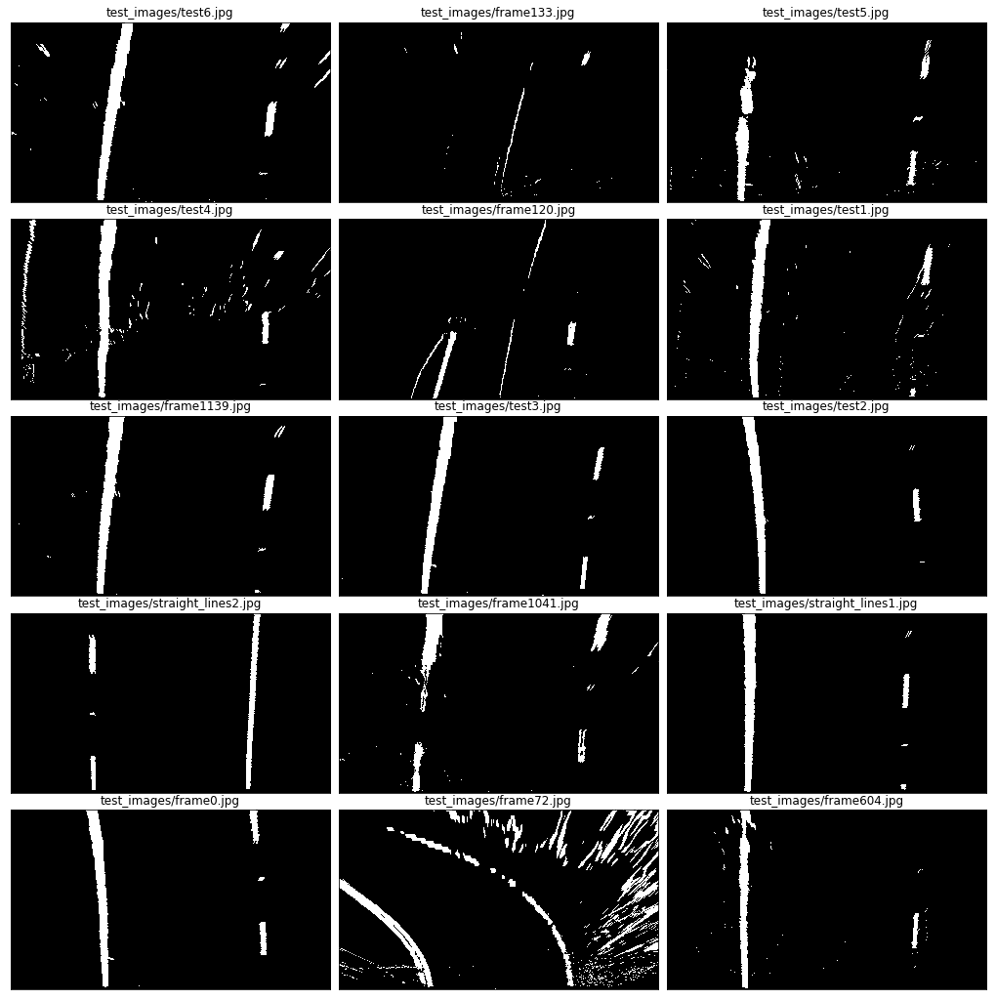


## <span id="jump5">Step 5: Detect lane pixels and fit to find the lane boundary.</span>

---
### Line Finding Method: Peaks in a Histogram


```python
def show_histogram(binary_image):   
    histogram = np.sum(binary_image[binary_image.shape[0]//2:, :], axis=0)
    plt.plot(histogram)
```


```python
show_histogram(warped_images[0])
```


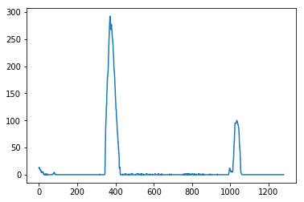


```python
def fitlines(binary_warped, nwindows=9, margin=100, minpix=50, bias=0.2):
    """
    margin: Set the width of the windows +/- margin
    minpix: Set minimum number of pixels found to recenter window
    bias: left start and right start offest from middpoint
    """
    # Assuming you have created a warped binary image called "binary_warped"
    # Take a histogram of the bottom half of the image
    histogram = np.sum(binary_warped[binary_warped.shape[0]//2:,:], axis=0)
    
    # Create an output image to draw on and  visualize the result
    out_img = np.dstack((binary_warped, binary_warped, binary_warped))*255
    # Find the peak of the left and right halves of the histogram
    # These will be the starting point for the left and right lines
    midpoint = np.int(histogram.shape[0]/2)
    
    leftstart = int((1-bias)*midpoint)
    rightstart = int((1+bias)*midpoint)
    
    leftx_base = np.argmax(histogram[:leftstart])
    rightx_base = np.argmax(histogram[rightstart:]) + rightstart

    # Set height of windows
    window_height = np.int(binary_warped.shape[0]/nwindows)
    # Identify the x and y positions of all nonzero pixels in the image
    nonzero = binary_warped.nonzero()
    nonzeroy = np.array(nonzero[0])
    nonzerox = np.array(nonzero[1])

    # Current positions to be updated for each window
    leftx_current = leftx_base
    rightx_current = rightx_base

    left_lane_inds = []
    right_lane_inds = []

    # Step through the windows one by one
    for window in range(nwindows):
        # Identify window boundaries in x and y (and right and left)
        win_y_low = binary_warped.shape[0] - (window+1)*window_height
        win_y_high = binary_warped.shape[0] - window*window_height
        win_xleft_low = leftx_current - margin
        win_xleft_high = leftx_current + margin
        win_xright_low = rightx_current - margin
        win_xright_high = rightx_current + margin
        
        # Draw the windows on the visualization image
        cv2.rectangle(out_img,(win_xleft_low,win_y_low),(win_xleft_high,win_y_high),(0,255,0), 4) 
        cv2.rectangle(out_img,(win_xright_low,win_y_low),(win_xright_high,win_y_high),(0,255,0), 4) 
        
        # Identify the nonzero pixels in x and y within the window
        good_left_inds = ((nonzeroy >= win_y_low) & (nonzeroy < win_y_high) & (nonzerox >= win_xleft_low) &  (nonzerox < win_xleft_high)).nonzero()[0]
        good_right_inds = ((nonzeroy >= win_y_low) & (nonzeroy < win_y_high) & (nonzerox >= win_xright_low) &  (nonzerox < win_xright_high)).nonzero()[0]
        
        # Append these indices to the lists
        left_lane_inds.append(good_left_inds)
        right_lane_inds.append(good_right_inds)

        # If you found > minpix pixels, recenter next window on their mean position
        if len(good_left_inds) > minpix:
            leftx_current = np.int(np.mean(nonzerox[good_left_inds]))
        if len(good_right_inds) > minpix:        
            rightx_current = np.int(np.mean(nonzerox[good_right_inds]))

    # Concatenate the arrays of indices
    left_lane_inds = np.concatenate(left_lane_inds)
    right_lane_inds = np.concatenate(right_lane_inds)

    # Extract left and right line pixel positions
    leftx = nonzerox[left_lane_inds]
    lefty = nonzeroy[left_lane_inds] 
    rightx = nonzerox[right_lane_inds]
    righty = nonzeroy[right_lane_inds] 

    out_img[nonzeroy[left_lane_inds], nonzerox[left_lane_inds]] = [255, 0, 0]
    out_img[nonzeroy[right_lane_inds], nonzerox[right_lane_inds]] = [0, 0, 255] 
    
    left_fit = None
    right_fit = None
    
    ploty = np.linspace(0, binary_warped.shape[0]-1, binary_warped.shape[0] )
    
    # Fit a second order polynomial to each
    if len(leftx) != 0:
        left_fit = np.polyfit(lefty, leftx, 2)
        p_left = np.poly1d(left_fit)
        left_fitx = p_left(ploty)
        left_line_pts = np.array([np.transpose(np.vstack([left_fitx, ploty]))])
        cv2.polylines(out_img, np.int_(left_line_pts), isClosed=False, color=(255,255,0), thickness=5)
        
    if len(rightx) != 0:
        right_fit = np.polyfit(righty, rightx, 2)
        p_right = np.poly1d(right_fit)
        right_fitx = p_right(ploty)   
        right_line_pts = np.array([np.transpose(np.vstack([right_fitx, ploty]))])
        cv2.polylines(out_img, np.int_(right_line_pts), isClosed=False, color=(255,255,0), thickness=5)
    
    return out_img, left_fit, right_fit
```


```python
fitline_images = list(map(fitlines, warped_images))

fittedimges = [s[0] for s in fitline_images]
left_fits = [s[1] for s in fitline_images]
right_fits = [s[2] for s in fitline_images]

showImages(fittedimges, testImageList, ticksshow=False)
```


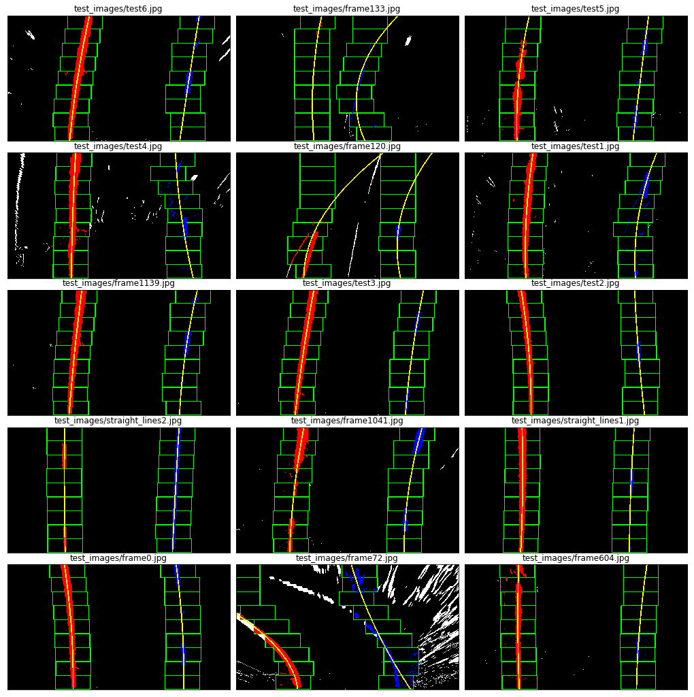


```python
def fitted_lanes(binary_warped, left_fit, right_fit, margin = 100, minpix = 50):
    # Assume you now have a new warped binary image 
    # from the next frame of video (also called "binary_warped")
    # It's now much easier to find line pixels!
    nonzero = binary_warped.nonzero()
    nonzeroy = np.array(nonzero[0])
    nonzerox = np.array(nonzero[1])

    left_lane_inds = ((nonzerox > (left_fit[0]*(nonzeroy**2) + left_fit[1]*nonzeroy + 
    left_fit[2] - margin)) & (nonzerox < (left_fit[0]*(nonzeroy**2) + 
    left_fit[1]*nonzeroy + left_fit[2] + margin))) 

    right_lane_inds = ((nonzerox > (right_fit[0]*(nonzeroy**2) + right_fit[1]*nonzeroy + 
    right_fit[2] - margin)) & (nonzerox < (right_fit[0]*(nonzeroy**2) + 
    right_fit[1]*nonzeroy + right_fit[2] + margin)))  

    # Again, extract left and right line pixel positions
    leftx = nonzerox[left_lane_inds]
    lefty = nonzeroy[left_lane_inds] 
    rightx = nonzerox[right_lane_inds]
    righty = nonzeroy[right_lane_inds]
    
    # Create an image to draw on and an image to show the selection window
    out_img = np.dstack((binary_warped, binary_warped, binary_warped))*255
    window_img = np.zeros_like(out_img)
    # Color in left and right line pixels
    out_img[nonzeroy[left_lane_inds], nonzerox[left_lane_inds]] = [255, 0, 0]
    out_img[nonzeroy[right_lane_inds], nonzerox[right_lane_inds]] = [0, 0, 255]
    
    left_new_fit = None
    right_new_fit = None
    
    ploty = np.linspace(0, binary_warped.shape[0]-1, binary_warped.shape[0] )
    # Fit a second order polynomial to each
    p_left = np.poly1d(left_fit)
    left_fitx = p_left(ploty)
        
    left_line_window1 = np.array([np.transpose(np.vstack([left_fitx-margin, ploty]))])
    left_line_window2 = np.array([np.flipud(np.transpose(np.vstack([left_fitx+margin, 
                                  ploty])))])
    left_line_pts = np.hstack((left_line_window1, left_line_window2))
    cv2.fillPoly(window_img, np.int_([left_line_pts]), (0,255, 0))
    
    p_right = np.poly1d(right_fit)
    right_fitx = p_right(ploty) 
        
     # Generate a polygon to illustrate the search window area
    right_line_window1 = np.array([np.transpose(np.vstack([right_fitx-margin, ploty]))])
    right_line_window2 = np.array([np.flipud(np.transpose(np.vstack([right_fitx+margin, 
                                  ploty])))])
    right_line_pts = np.hstack((right_line_window1, right_line_window2))

    # Draw the lane onto the warped blank image
    
    cv2.fillPoly(window_img, np.int_([right_line_pts]), (0,255, 0))
        
    
    if len(leftx) != 0:
        left_new_fit = np.polyfit(lefty, leftx, 2)
        p_left = np.poly1d(left_new_fit)
        left_fitx = p_left(ploty)
        # Generate a polygon to illustrate the search window area
        # And recast the x and y points into usable format for cv2.fillPoly()

        left_line_pts = np.array([np.transpose(np.vstack([left_fitx, ploty]))])
        cv2.polylines(out_img, np.int_(left_line_pts), isClosed=False, color=(255,255,0), thickness=5)
            
    if len(rightx) != 0:
        right_new_fit = np.polyfit(righty, rightx, 2)
        p_right = np.poly1d(right_new_fit)
        right_fitx = p_right(ploty)  
        
      
        right_line_pts = np.array([np.transpose(np.vstack([right_fitx, ploty]))])
        cv2.polylines(out_img, np.int_(right_line_pts), isClosed=False, color=(255,255,0), thickness=5)
    
    result = cv2.addWeighted(out_img, 1, window_img, 0.3, 0)
    
    return result,left_new_fit,right_new_fit
```


```python
recogin_images = list(map(fitted_lanes, warped_images, left_fits, right_fits))

fittedimges = [s[0] for s in recogin_images]
left_fits = [s[1] for s in recogin_images]
right_fits = [s[2] for s in recogin_images]

showImages(fittedimges, testImageList, ticksshow=False)
```


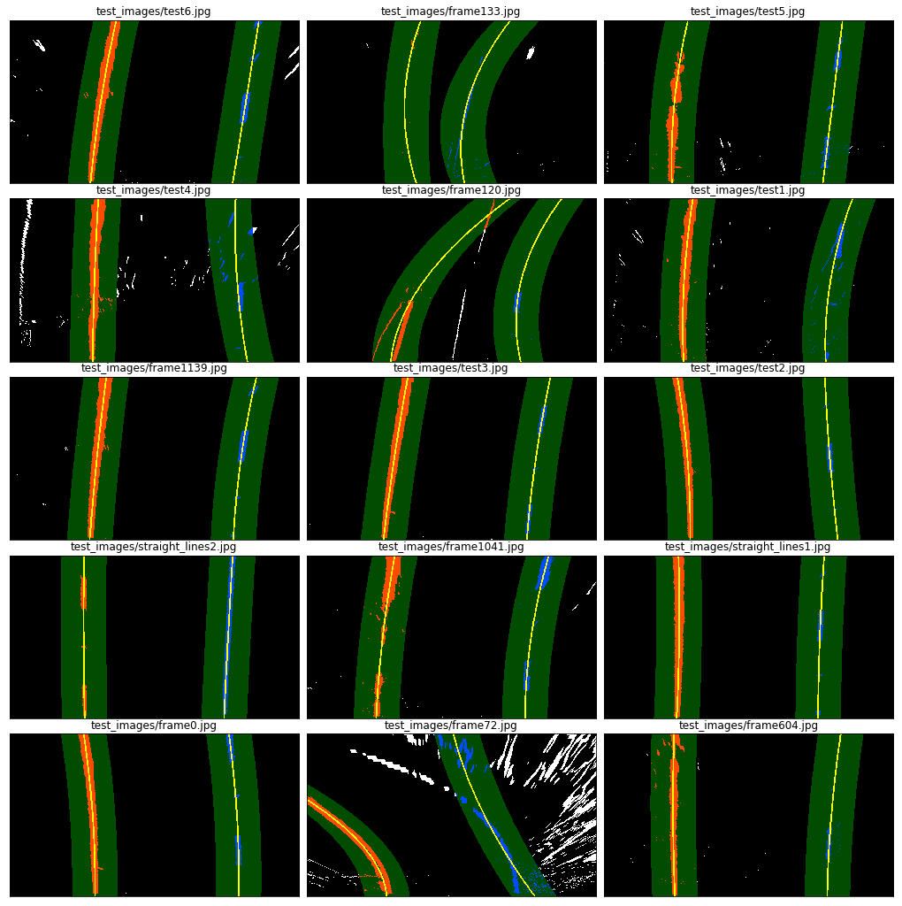


## <span id="jump6">Setp 6: Determine the curvature of the lane and vehicle position with respect to center.</span>

---
### Measure Lane Curvature


```python
def calculate_curvature(binary_warped, line_fit):
    # Define conversions in x and y from pixels space to meters
    ym_per_pix = 30/720 # meters per pixel in y dimension
    xm_per_pix = 3.7/700 # meters per pixel in x dimension

    ploty = np.linspace(0, binary_warped.shape[0]-1, binary_warped.shape[0] )
    line_fitx = line_fit[0]*ploty**2 + line_fit[1]*ploty + line_fit[2]
    
    y_eval = np.max(ploty)
    
    # Fit new polynomials to x,y in world space
    line_fit_cr = np.polyfit(ploty*ym_per_pix, line_fitx*xm_per_pix, 2)
    
    # Calculate the new radii of curvature
    cal_curverad = ((1 + (2*line_fit_cr[0]*y_eval*ym_per_pix + line_fit_cr[1])**2)**1.5) / np.absolute(2*line_fit_cr[0])
    
    # Calculate line position offset to center
    p_line = np.poly1d(line_fit)
    line_fitx_1 = p_line(y_eval)
    
    center_offset = (line_fitx_1 - binary_warped.shape[1]/2)*xm_per_pix
    
    return cal_curverad, center_offset
```

## <span id="jump7">Setp 7: Warp the detected lane boundaries back onto the original image.</span>


```python
def unwarp(img, left_fit, right_fit):
    img_size = img.shape[:2][::-1]
    
    M, Minv = perspective_transform_matrix(img)
    
    if left_fit.any() != None and right_fit.any() != None:    
        color_warp = np.zeros_like(img).astype(np.uint8)

        ploty = np.linspace(0, img.shape[0]-1, img.shape[0] )
        left_fitx = left_fit[0]*ploty**2 + left_fit[1]*ploty + left_fit[2]
        right_fitx = right_fit[0]*ploty**2 + right_fit[1]*ploty + right_fit[2]

        # Recast the x and y points into usable format for cv2.fillPoly()
        pts_left = np.array([np.transpose(np.vstack([left_fitx, ploty]))])
        pts_right = np.array([np.flipud(np.transpose(np.vstack([right_fitx, ploty])))])
        pts = np.hstack((pts_left, pts_right))

        # Draw the lane onto the warped blank image
        cv2.fillPoly(color_warp, np.int_([pts]), (0,255, 0))

        # Warp the blank back to original image space using inverse perspective matrix (Minv)
        newwarp = cv2.warpPerspective(color_warp, Minv, (img.shape[1], img.shape[0])) 
        # Combine the result with the original image
        result = cv2.addWeighted(img, 1, newwarp, 0.3, 0)
    else:
        result = img
    
    return result
```


```python
unwarp_images = list(map(unwarp, images_undistort, left_fits, right_fits))

showImages(unwarp_images, testImageList)
```


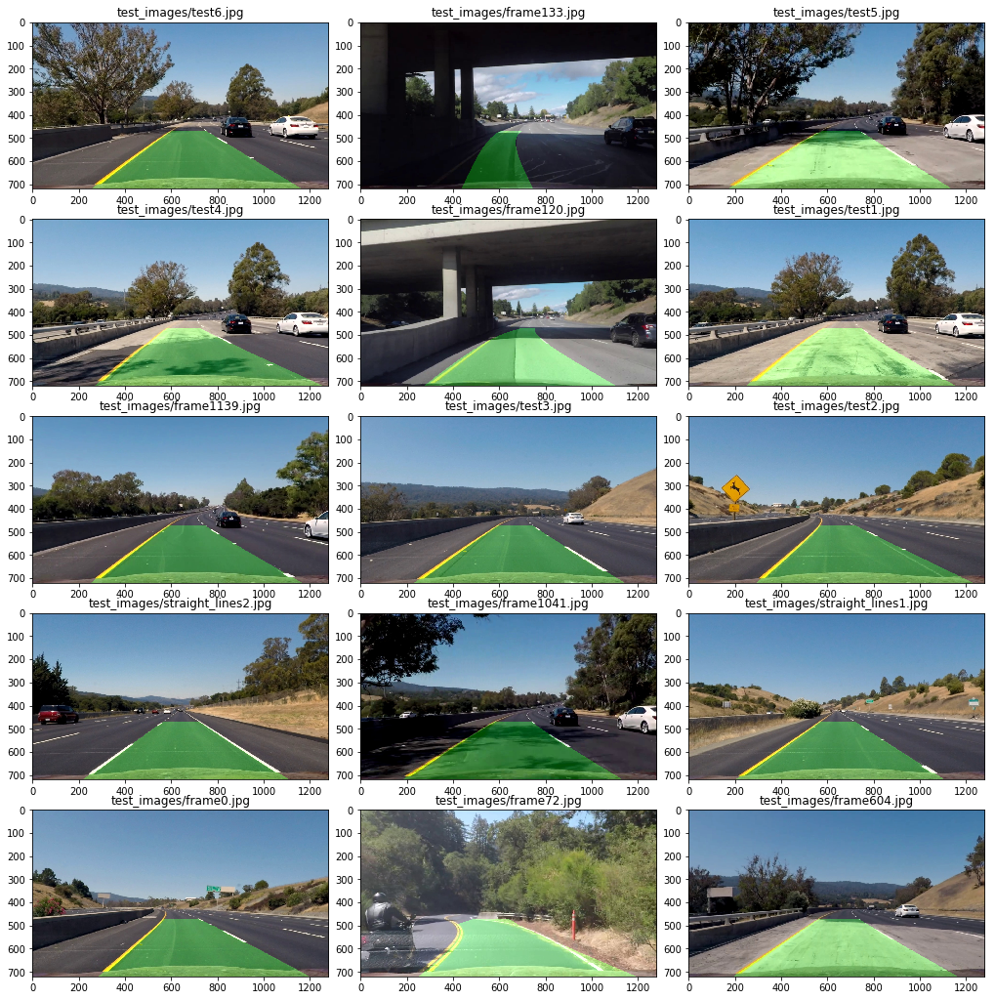


## <span id="jump8">Setp 8: Output visual display of the lane boundaries and numerical estimation of lane curvature and vehicle position.</span>


```python
def draw_estimation(img, left_fit, right_fit):
    
    if left_fit.any() != None and right_fit.any() != None:
        left_cur, left_center_offest = calculate_curvature(img, left_fit)
        right_cur, right_center_offest = calculate_curvature(img, right_fit)

        center_offest = (left_center_offest + right_center_offest)/2.0

        cv2.putText(img,'left curvature:{:.2f}m'.format(left_cur),(10,60),cv2.FONT_HERSHEY_COMPLEX,2,(255,255,255),3)
        cv2.putText(img,'right curvature:{:.2f}m'.format(right_cur),(10,130),cv2.FONT_HERSHEY_COMPLEX,2,(255,255,255),3)
        cv2.putText(img,'center offest:{:.2f}m'.format(center_offest),(10,200),cv2.FONT_HERSHEY_COMPLEX,2,(255,255,255),3)
    
    return img
```


```python
res_images= list(map(draw_estimation, unwarp_images, left_fits, right_fits))

showImages(res_images,testImageList)
```


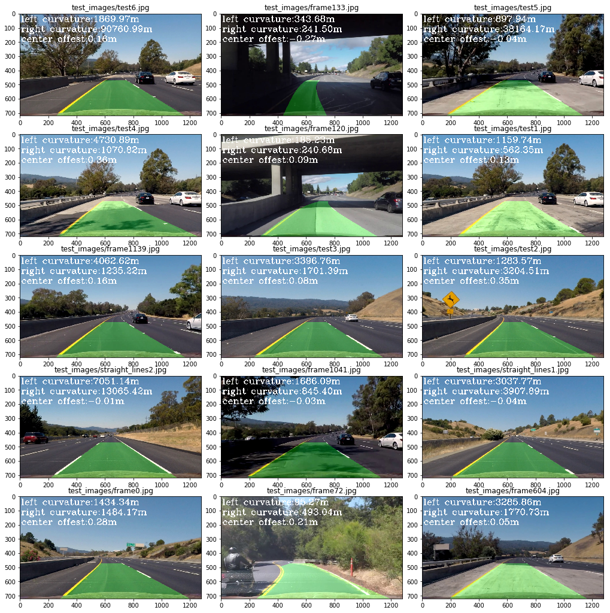


## Image Process with Debug
---
### Define Line Class


```python
from collections import deque

# Define a class to receive the characteristics of each line detection
class Line():
    def __init__(self, maxlen=10):
        # was the line detected in the last iteration?
        self.detected = False  
        
        # x values of the last n fits of the line
        self.recent_xfitted = deque(maxlen = maxlen) 
        #average x values of the fitted line over the last n iterations
        self.bestx = None     
        
        #polynomial coefficients averaged over the last n iterations
        self.best_fit = None  
        #polynomial coefficients for the most recent fit
        self.current_fit = [np.array([False])]  
        
        #radius of curvature of the line in some units
        self.radius_of_curvature = None 
        #distance in meters of vehicle center from the line
        self.line_base_pos = None 
        #difference in fit coefficients between last and new fits
        self.diffs = np.array([0,0,0], dtype='float') 
        

    def update_detected(self, img, detected=True):
        self.detected = detected  
        #if lane lines do not dectect correctly,remove from deque
        if self.detected == False and len(self.recent_xfitted) > 0:
            self.recent_xfitted.pop()
            
        self.update_bestx(img)
        self.update_best_fit(img)
            
    def update_recent_xfitted(self,img):
        yvals = np.linspace(0,img.shape[0]-1,img.shape[0])
        current_xval = self.current_fit[0]*yvals**2 + self.current_fit[1]*yvals + self.current_fit[2]
        self.recent_xfitted.append(current_xval)

    def update_bestx(self,img):
        if len(self.recent_xfitted) > 0:
            self.bestx = np.mean(self.recent_xfitted, axis=0)
        else:
            self.bestx = None
        
    def update_best_fit(self,img):
        if self.bestx.any() != None:
            yvals = np.linspace(0, img.shape[0]-1, img.shape[0] )
            line_new_fit = np.polyfit(yvals, self.bestx, 2)
            self.best_fit = line_new_fit
        else:
            self.best_fit = None
    
    def update_current_fit(self, fit):
        self.current_fit = fit
        
    def update_radius_of_curvature(self, img):
        self.radius_of_curvature, _ = calculate_curvature(img,self.current_fit)
    
    def update_line_base_pos(self, img):
        _, self.line_base_pos = calculate_curvature(img,self.current_fit)
        
    def update_diffs(self):
        if np.any(self.best_fit) != None:
            self.diffs = self.current_fit - self.best_fit
        else:
            self.diffs = np.array([0,0,0], dtype='float') 
        
    def upadate_data(self,img,fit):
        self.update_current_fit(fit)
        self.update_recent_xfitted(img)
        self.update_diffs()
        self.update_radius_of_curvature(img)
        self.update_line_base_pos(img)
    
    def reset_data(self):
        self.recent_xfitted.clear()
        self.bestx = None     
        self.best_fit = None  
```

### Define Line dectect Class
---
#### Sanity Check
* Checking that they have similiar curvature
* Checking that they are seperated by approximately the right distance horizontally
* Checking that they are roughly parallel


```python
class Linedectect():
    def __init__(self,maxlen=15):
        # was the line detected in the last iteration?
        self.detected = False  
        self.maxlen = maxlen
        self.lanedeparturecount =  0
        self.framenumbercnt =  0
        
        # Define left and right lines for detection
        self.left_lines = Line(self.maxlen)
        self.right_lines = Line(self.maxlen)

    def sanity_check(self,left_line,right_line):
        curv_ratio_threshold = 25
        distance_min_diff_bias = 200 #pixel in x dimension
        distance_pos_max_diff_bias = 1000 #pixel in x dimension
        distance_deviation_threshold = 100 #pixel in x dimension
    
        #Checking that they have similiar curvature
        left_radius_of_curvature = left_line.radius_of_curvature
        right_radius_of_curvature = right_line.radius_of_curvature

        curvature_ratio = left_radius_of_curvature/right_radius_of_curvature
        if curvature_ratio > curv_ratio_threshold or curvature_ratio <1.0/curv_ratio_threshold:
#             print("curvature_ratio:")
#             print(left_radius_of_curvature)
#             print(right_radius_of_curvature)
#             print(curvature_ratio)
            return False

        #Checking that they are seperated by approximately the right distance horizontally
        left_fitx = left_line.recent_xfitted[-1]
        right_fitx = right_line.recent_xfitted[-1]

        lane_horizon_distance = right_fitx - left_fitx
        lane_distance_max = max(lane_horizon_distance)
        lane_distance_min = min(lane_horizon_distance)

        if lane_distance_min < distance_min_diff_bias or lane_distance_max > distance_pos_max_diff_bias:
#             print("lane_distance:")
#             print(lane_distance_max)
#             print(lane_distance_min)
            return False

        # Checking that they are roughly parallel
        distance_deviation = np.std(lane_horizon_distance)
        if distance_deviation >= distance_deviation_threshold:
#             print("distance_deviation:")
#             print(distance_deviation)
            return False

        left_line_diff = np.absolute(left_line.diffs)
        if left_line_diff[0] > 0.01 or left_line_diff[1] > 0.5 or left_line_diff[2] > 100:
#             print("left_line_diff:")
#             print(left_line_diff)
            return False

        right_line_diff = np.absolute(right_line.diffs)
        if right_line_diff[0] > 0.01 or right_line_diff[1] > 0.5 or right_line_diff[2] > 100:
#             print("right_line_diff:")
#             print(right_line_diff)
            return False
        
        left_right_line_diff = np.absolute(left_line.current_fit - right_line.current_fit)
        if left_right_line_diff[0] > 0.01 or left_right_line_diff[1] > 0.5 :
#             print("left_right_line_diff:")
            return False        

        return True
    
    def line_find_process(self, image, left_line, right_line):      
        if self.lanedeparturecount >= self.maxlen:
            left_line.reset_data()
            right_line.reset_data()
            
        if np.any(left_line.best_fit) != None and np.any(right_line.best_fit) != None:
            fittedimg,recent_leftfitted,recent_rightfitted = fitted_lanes(image,left_line.best_fit,right_line.best_fit)
        else:
            fittedimg,recent_leftfitted,recent_rightfitted = fitlines(image)

        if recent_leftfitted.any() != None and recent_rightfitted.any() != None:
            left_line.upadate_data(image,recent_leftfitted)
            right_line.upadate_data(image,recent_rightfitted)

            if self.sanity_check(left_line,right_line) == True:
                left_line.update_detected(image,True)
                right_line.update_detected(image,True)
                self.lanedeparturecount = 0
            else:
                left_line.update_detected(image,False)
                right_line.update_detected(image,False)
                self.lanedeparturecount += 1 
        else:
            self.lanedeparturecount += 1
        
        return fittedimg,left_line.best_fit,right_line.best_fit  

    def image_lane_find_process(self,image,debugcombined = True,framenumber = None):

        undistort_images = imgUndistort(image)

        pipe_images = pipeline(undistort_images)

        warp_images = warpImage(pipe_images)

        fittedimg,recent_leftfitted,recent_rightfitted = self.line_find_process(warp_images,self.left_lines,self.right_lines)

        unwarp_images = unwarp(undistort_images,recent_leftfitted,recent_rightfitted)

        res_images = draw_estimation(unwarp_images,recent_leftfitted,recent_rightfitted)

        if debugcombined == True:
            # Calculate the size of screens
            result_screen_w = unwarp_images.shape[1]
            result_screen_h = unwarp_images.shape[0]
            debug_screen_w = np.int(result_screen_w/3)
            debug_screen_h = np.int(result_screen_h/3)
            screen_w = result_screen_w + debug_screen_w
            screen_h = result_screen_h

            # Assign result image to the screen
            #show screen
            screen = np.zeros((screen_h,screen_w,3),dtype=np.uint8)

            if framenumber != None:
                cv2.putText(unwarp_images,'frame index:{:}'.format(framenumber),(10,270),cv2.FONT_HERSHEY_COMPLEX,2,(255,255,255),3)
            
            cv2.putText(unwarp_images,'error count:{:}'.format(self.lanedeparturecount),(10,340),cv2.FONT_HERSHEY_COMPLEX,2,(255,255,255),3)

            screen[0:result_screen_h,0:result_screen_w] = res_images
            screen[0:result_screen_h,result_screen_w-2:result_screen_w] = (50,255,255)
            
            # Assign debug image to the screen
            debug_img_1 = np.dstack((pipe_images,pipe_images,pipe_images))*255
            screen[0:debug_screen_h,result_screen_w:,:] = cv2.resize(debug_img_1,(debug_screen_w,debug_screen_h))
            screen[debug_screen_h-2:debug_screen_h,result_screen_w:,:] = (50,255,255)
            
            debug_img_2 = np.dstack((warp_images,warp_images,warp_images))*255
            screen[debug_screen_h : debug_screen_h*2,result_screen_w:,:] =cv2.resize(debug_img_2,(debug_screen_w,debug_screen_h))
            screen[debug_screen_h*2-2 : debug_screen_h*2,result_screen_w:,:] = (50,255,255)
            
            debug_img_3 = fittedimg
            screen[debug_screen_h*2 : debug_screen_h*3,result_screen_w:,:] =cv2.resize(debug_img_3,(debug_screen_w,debug_screen_h))

            return screen
        else:
            return unwarp_images
        
    def video_process_show(self,image):
        res_img = self.image_lane_find_process(image,framenumber=self.framenumbercnt)
            
        self.framenumbercnt += 1
            
        return res_img
```


```python
image_process_test_image = testImages[0]

plt.figure(figsize=(8, 8))
plt.imshow(image_process_test_image) 
plt.title('Original Image')

plt.figure(figsize=(16, 16))
L = Linedectect()
warp_image_process_test_image = L.video_process_show(image_process_test_image)
plt.imshow(warp_image_process_test_image) 
plt.title('Result Image')
```


    Text(0.5,1,'Result Image')


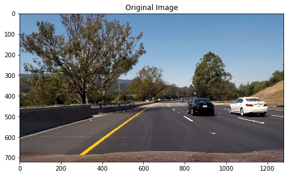


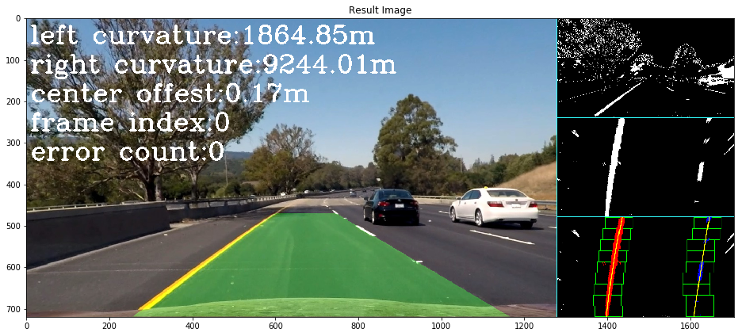


### Test Videos


```python
from moviepy.editor import VideoFileClip
from IPython.display import HTML
```


```python
project_source = "test_videos/project_video.mp4"
project_output = "output_videos/project_video_output.mp4"


## To speed up the testing process you may want to try your pipeline on a shorter subclip of the video
## To do so add .subclip(start_second,end_second) to the end of the line below
## Where start_second and end_second are integer values representing the start and end of the subclip
## You may also uncomment the following line for a subclip of the first 5 seconds
##clip1 = VideoFileClip("test_videos/solidWhiteRight.mp4").subclip(0,5)
L = Linedectect()
clip1 = VideoFileClip(project_source)
line_clip = clip1.fl_image(L.video_process_show) #NOTE: this function expects color images!!
%time line_clip.write_videofile(project_output, audio=False)
```

    [MoviePy] >>>> Building video output_videos/project_video_output.mp4
    [MoviePy] Writing video output_videos/project_video_output.mp4


    100%|█████████▉| 1260/1261 [02:05<00:00, 10.04it/s]


    [MoviePy] Done.
    [MoviePy] >>>> Video ready: output_videos/project_video_output.mp4 
    
    CPU times: user 8min 20s, sys: 34.9 s, total: 8min 55s
    Wall time: 2min 6s


```python
HTML("""
<video width="960" height="450" controls>
  <source src="{0}">
</video>
""".format(project_output))
```


<video width="960" height="450" controls>
  <source src="output_videos/project_video_output.mp4">
</video>


## <span id="jump8">Setp 9: Discussion.</span>

#### 1. Briefly discuss any problems / issues you faced in your implementation of this project.  Where will your pipeline likely fail?  What could you do to make it more robust?

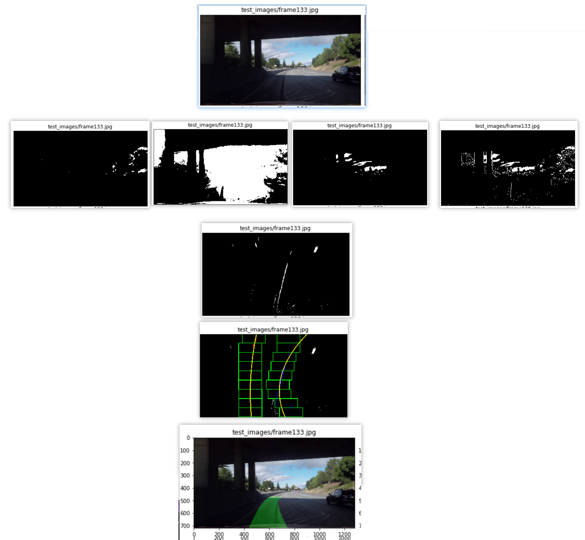   

From above image, we can see the frame133.jpg was failed to find lane. There are some factors which lead to this. There was shadow on the road witch is lead to select lane color difficultly. The bounder between new and old pavement was recognised to lane using sobel filter.    

I could combine previous frames to process this frame. Because the location of the lane should not change acutely.